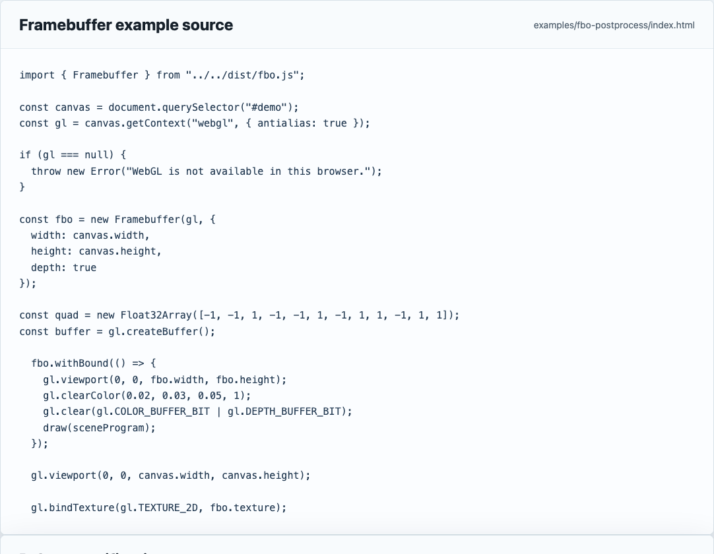
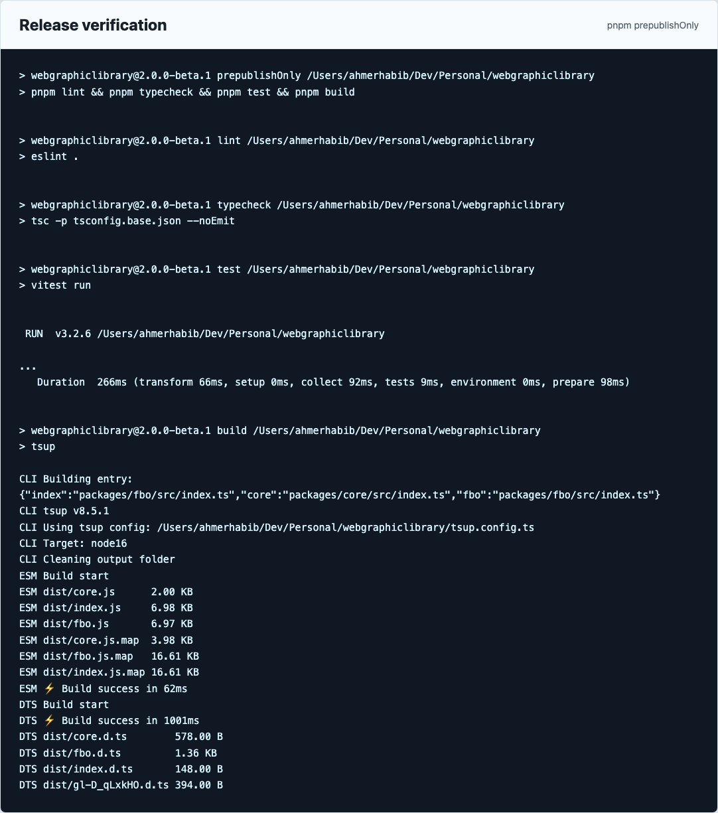
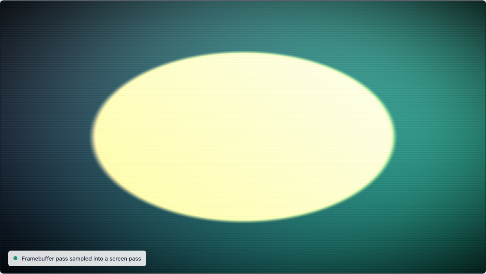

# webgraphiclibrary

[](https://github.com/ahmerhabib/webgraphiclibrary/actions/workflows/ci.yml) [](https://www.npmjs.com/package/webgraphiclibrary) [](LICENSE.md)

Small, type-safe WebGL utilities for people who still like working close to the graphics API.

webgraphiclibrary is not a scene graph, renderer, game engine, or replacement for Three.js. It is a set of focused wrappers around WebGL resources that are easy to reason about, easy to clean up, and small enough to drop into rendering experiments, post-processing pipelines, teaching projects, and custom engines.

The first v2 module is the framebuffer wrapper. It turns the noisy WebGL framebuffer setup flow into a small lifecycle API while keeping the underlying WebGL objects available when you need direct control.


## Problem this solves

Raw WebGL is powerful, but the everyday setup code is repetitive and easy to get wrong. A framebuffer needs a texture, attachment setup, optional depth or stencil storage, completeness checks, viewport handling, resize behavior, readback, and disposal. Missing any one of those details can leave a render pass blank with very little help from the browser.

webgraphiclibrary gives those low-level resources a small TypeScript API without hiding WebGL. The goal is to make custom rendering code less fragile while still letting developers bind the raw WebGL objects, write their own shaders, and build their own pipeline.

## Why this package

- It stays close to WebGL instead of introducing an engine-level abstraction.
- It validates resource setup early, including framebuffer completeness.
- It keeps lifecycle operations explicit: bind, scoped bind, resize, read pixels, and dispose.
- It ships focused subpath exports, so applications can import only the modules they use.
- It is designed as a rebuilt v2 home for the earlier WebGraphicLibrary packages, with each resource wrapper tested and documented before the next one is added.

## Project snapshots

The screenshots below are generated by `pnpm screenshots`. The script runs the package release check, captures the real terminal output, serves the browser demo locally, and screenshots the rendered framebuffer workflow with Playwright.







## Install

```bash
npm install webgraphiclibrary@beta
```

```bash
pnpm add webgraphiclibrary@beta
```

## Imports

```ts
import { Framebuffer } from "webgraphiclibrary/fbo";
import { WebGLError } from "webgraphiclibrary/core";
```

The package uses subpath exports so each module stays explicit. The current beta exports:

- `webgraphiclibrary/fbo`
- `webgraphiclibrary/core`

## Framebuffer quick start

```ts
import { Framebuffer } from "webgraphiclibrary/fbo";

const canvas = document.querySelector("canvas");
if (!(canvas instanceof HTMLCanvasElement)) {
  throw new Error("Canvas element was not found.");
}

const gl = canvas.getContext("webgl");
if (gl === null) {
  throw new Error("WebGL is not available.");
}

const fbo = new Framebuffer(gl, {
  width: 512,
  height: 512,
  depth: true
});

fbo.withBound(() => {
  gl.viewport(0, 0, fbo.width, fbo.height);
  gl.clearColor(0, 0, 0, 1);
  gl.clear(gl.COLOR_BUFFER_BIT | gl.DEPTH_BUFFER_BIT);

  // Draw the off-screen scene here.
});

gl.viewport(0, 0, canvas.width, canvas.height);
gl.bindTexture(gl.TEXTURE_2D, fbo.texture);

// Draw a fullscreen quad here and sample fbo.texture in the fragment shader.

fbo.dispose();
```

## Browser demo

The example in [examples/fbo-postprocess](examples/fbo-postprocess) renders into a `Framebuffer`, then samples `framebuffer.texture` in a screen-space post-process pass. It intentionally uses raw WebGL shader setup around the wrapper so the value of the package is visible: the framebuffer lifecycle is handled by the library, while the rendering pipeline remains fully under the developer's control.

To refresh the compiled package and screenshots:

```bash
pnpm screenshots
```

## Framebuffer API

### `new Framebuffer(gl, options)`

Creates a color framebuffer target backed by a `WebGLTexture`.

```ts
const fbo = new Framebuffer(gl, {
  width: 1024,
  height: 1024,
  depth: true
});
```

Options:

| Option           | Type      | Default            | Notes                                        |
| ---------------- | --------- | ------------------ | -------------------------------------------- |
| `width`          | `number`  | required           | Positive integer width in pixels             |
| `height`         | `number`  | required           | Positive integer height in pixels            |
| `internalFormat` | `number`  | `gl.RGBA`          | Texture internal format                      |
| `format`         | `number`  | `gl.RGBA`          | Texture data format                          |
| `type`           | `number`  | `gl.UNSIGNED_BYTE` | Texture data type                            |
| `minFilter`      | `number`  | `gl.LINEAR`        | Texture minification filter                  |
| `magFilter`      | `number`  | `gl.LINEAR`        | Texture magnification filter                 |
| `wrapS`          | `number`  | `gl.CLAMP_TO_EDGE` | Horizontal texture wrapping                  |
| `wrapT`          | `number`  | `gl.CLAMP_TO_EDGE` | Vertical texture wrapping                    |
| `depth`          | `boolean` | `false`            | Adds a `DEPTH_COMPONENT16` renderbuffer      |
| `stencil`        | `boolean` | `false`            | Adds a combined `DEPTH_STENCIL` renderbuffer |

### Properties

| Property       | Type                                              | Notes                             |
| -------------- | ------------------------------------------------- | --------------------------------- |
| `gl`           | `WebGLRenderingContext \| WebGL2RenderingContext` | Context passed to the constructor |
| `width`        | `number`                                          | Current framebuffer width         |
| `height`       | `number`                                          | Current framebuffer height        |
| `framebuffer`  | `WebGLFramebuffer`                                | Underlying framebuffer object     |
| `texture`      | `WebGLTexture`                                    | Color attachment texture          |
| `renderbuffer` | `WebGLRenderbuffer \| null`                       | Depth or depth-stencil storage    |
| `disposed`     | `boolean`                                         | `true` after disposal             |

### Methods

#### `bind()`

Binds the framebuffer so future draw calls write into `texture`.

#### `unbind()`

Binds the default screen framebuffer.

#### `withBound(render)`

Binds the framebuffer, runs the callback, and unbinds in a `finally` block. This keeps render passes compact and still makes the WebGL state change explicit.

```ts
fbo.withBound(() => {
  renderScene();
});
```

#### `resize({ width, height })`

Reallocates texture and renderbuffer storage while keeping the same framebuffer object.

```ts
fbo.resize({ width: canvas.width, height: canvas.height });
```

#### `resizeToCanvas(canvas)`

Convenience wrapper for matching a framebuffer to a canvas backing-store size.

```ts
fbo.resizeToCanvas(canvas);
```

#### `readPixels()`

Reads the color attachment into a `Uint8Array` of length `width * height * 4`.

```ts
const pixels = fbo.readPixels();
const firstPixel = pixels.slice(0, 4);
```

#### `dispose()`

Deletes the framebuffer, color texture, and optional renderbuffer. Disposal is idempotent, so repeated calls are safe.

## Compatibility alias

The v2 API prefers the descriptive `Framebuffer` name, but the shorter `FBO` alias is exported too:

```ts
import { FBO } from "webgraphiclibrary/fbo";

const target = new FBO(gl, { width: 512, height: 512 });
```

## Error behavior

The library throws early for invalid usage:

- non-WebGL context values
- non-integer or non-positive dimensions
- failed WebGL resource allocation
- incomplete framebuffer status
- use after `dispose()`

Base WebGL-related failures extend `WebGLError`. Use-after-dispose failures throw `DisposedResourceError`.

## Development

```bash
pnpm install
pnpm verify
```

`pnpm verify` is the project quality gate. It checks formatting, regenerates the README screenshots from the real package workflow, runs linting, type checking, tests, and build through `pnpm prepublishOnly`, then inspects the npm package contents with `npm pack --dry-run`.

`pnpm screenshots` runs `pnpm prepublishOnly`, captures the verification output, serves the browser demo locally, and regenerates the README screenshots with Playwright.

## GitHub and npm release flow

GitHub pushes do not automatically update npm. npm only changes when a new package version is published to the npm registry.

This repository includes two GitHub Actions workflows:

- `.github/workflows/ci.yml` runs formatting, linting, type checking, tests, build, and screenshot generation on pushes and pull requests.
- `.github/workflows/publish.yml` is prepared for npm publishing from version tags such as `v2.0.0-beta.2`.

For automated npm publishing, configure npm Trusted Publishing for the package on npmjs.com:

- Publisher: GitHub Actions
- Owner/user: `ahmerhabib`
- Repository: `webgraphiclibrary`
- Workflow filename: `publish.yml`
- Allowed action: `npm publish`

After that is configured, the release path is:

```bash
pnpm version prerelease --preid beta
git push --follow-tags
```

The tag push triggers the publish workflow. The detailed checklist lives in [docs/release.md](docs/release.md). Until Trusted Publishing is configured, publish manually:

```bash
npm publish --tag beta
```

## npm package

The current release target is the beta package:

```bash
npm install webgraphiclibrary@beta
```

The package ships compiled ESM output, TypeScript declarations, README assets, and examples.

## Project standards

- [CHANGELOG.md](CHANGELOG.md) tracks user-visible package changes.
- [CONTRIBUTING.md](CONTRIBUTING.md) documents the local development and review bar.
- [SECURITY.md](SECURITY.md) describes the security and release reporting posture.
- [docs/release.md](docs/release.md) documents manual and automated npm release paths.

## Roadmap

The older WebGraphicLibrary packages are being rebuilt around the same small, typed-resource approach. The next modules are:

- shader compilation
- program linking and uniform helpers
- typed vertex/index buffers
- texture upload helpers
- texture display debugging utilities

Sprite-style helpers are intentionally outside the first v2 scope. They fit better as examples built on top of the low-level modules.

## Related repositories

This repository is the new home for the v2 work. The original package repositories are still useful for history and comparison:

| Repository                                                                                               | Notes                            |
| -------------------------------------------------------------------------------------------------------- | -------------------------------- |
| [WebGraphicLibrary-fixedbaseoperator](https://github.com/ahmerhabib/WebGraphicLibrary-fixedbaseoperator) | Original framebuffer/FBO package |
| [WebGraphicLibrary-texture-display](https://github.com/ahmerhabib/WebGraphicLibrary-texture-display)     | Texture display helper           |
| [WebGraphicLibrary-buffer](https://github.com/ahmerhabib/WebGraphicLibrary-buffer)                       | WebGL buffer wrapper             |
| [WebGraphicLibrary-sprite](https://github.com/ahmerhabib/WebGraphicLibrary-sprite)                       | Sprite template package          |
| [webgraphiclibrary-program](https://github.com/ahmerhabib/webgraphiclibrary-program)                     | WebGL program wrapper            |
| [WebGraphicLibrary-texture](https://github.com/ahmerhabib/WebGraphicLibrary-texture)                     | WebGL texture wrapper            |
| [WebGraphicLibrary-context](https://github.com/ahmerhabib/WebGraphicLibrary-context)                     | Canvas context helper            |
| [WebGraphicLibrary-shader](https://github.com/ahmerhabib/WebGraphicLibrary-shader)                       | WebGL shader wrapper             |

## License

MIT
