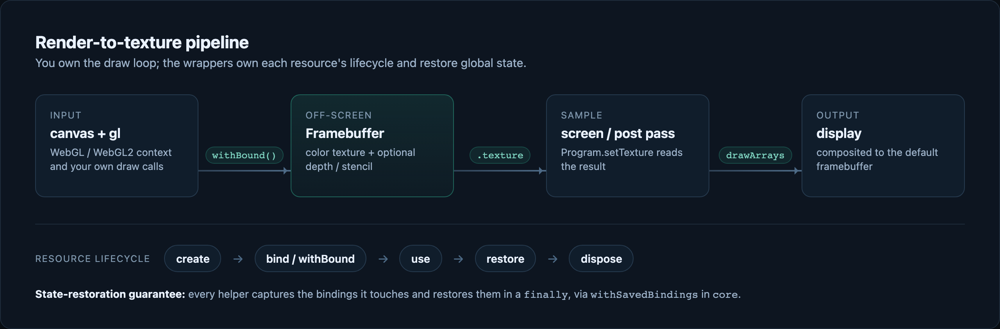

# webgraphiclibrary

[](https://github.com/ahmerhabib/webgraphiclibrary/actions/workflows/ci.yml)
[](https://www.npmjs.com/package/webgraphiclibrary)
[](https://bundlephobia.com/package/webgraphiclibrary)
[](https://www.typescriptlang.org/)
[](LICENSE.md)
[](https://scorecard.dev/viewer/?uri=github.com/ahmerhabib/webgraphiclibrary)

**Typed WebGL resource wrappers for people who write their own render loop.**

webgraphiclibrary gives each repetitive, leak-prone WebGL resource — framebuffers, shaders, programs, buffers, and textures — a small, strongly-typed lifecycle API, then gets out of your way. No scene graph. No materials. No hidden global state. You keep the raw `WebGL*` handles and your own draw calls; the library removes the boilerplate that is easy to get subtly wrong and painful to debug.


```ts
import { Framebuffer } from "webgraphiclibrary/fbo";

const target = new Framebuffer(gl, { width: 1024, height: 1024, depth: true });

target.withBound(() => {
  gl.viewport(0, 0, target.width, target.height);
  gl.clear(gl.COLOR_BUFFER_BIT | gl.DEPTH_BUFFER_BIT);
  drawScene(); // your raw WebGL, unchanged
});

// target.texture now holds the rendered image — sample it in a fullscreen pass.
gl.bindTexture(gl.TEXTURE_2D, target.texture);
```

## Why webgraphiclibrary

Hand-written WebGL is not hard because the ideas are hard — it is hard because every resource has a create → configure → bind → use → restore → delete lifecycle, all of it mutating one big global state machine, and one wrong enum gives you a black screen with no error. This library encodes that lifecycle once, with types, so your renderer stays readable.

- **Strictly typed, TypeScript-first.** Written in TypeScript with precise types and full declarations — not JS with generated `.d.ts` bolted on.
- **Tree-shakeable by resource.** Import exactly what you use through per-resource subpaths (`webgraphiclibrary/fbo`, `webgraphiclibrary/texture`, …). Pay only for the resource you touch.
- **State-restoration guarantees.** Every helper that must bind a resource captures the previous binding and restores it in a `finally` — so a resize or a readback never silently breaks the renderer that called it.
- **Explicit lifecycle, raw handles kept.** `bind` / `withBound` / `resize` / `dispose`, idempotent disposal, typed errors — and `framebuffer.texture`, `program.program`, `buffer.buffer` are always right there when you need direct control.
- **Zero runtime dependencies.** Small, auditable, ESM-only.

### When to use it (and when not)

| If you need…                                                      | Use…                   |
| ----------------------------------------------------------------- | ---------------------- |
| A 3D scene graph, cameras, materials, loaders, controls           | Three.js or Babylon.js |
| A fast 2D scene graph for games / interactive canvases            | PixiJS                 |
| A high-level 2D object model or whiteboard SDK                    | Konva, Fabric, tldraw  |
| Charts and data visualization                                     | D3 or Chart.js         |
| **Typed WebGL building blocks for a renderer you write yourself** | **webgraphiclibrary**  |

Its real neighbors are the low-level WebGL helpers — `twgl.js`, `regl`, `picogl.js`, `OGL`, `luma.gl`:

| Library               | Category                | TS-native | Tree-shake by resource | Notes                                       |
| --------------------- | ----------------------- | :-------: | :--------------------: | ------------------------------------------- |
| **webgraphiclibrary** | Typed resource wrappers |    Yes    |          Yes           | Explicit lifecycle, state-restoration, tiny |
| twgl.js               | WebGL helper functions  |   JSDoc   |           No           | Great ergonomics; JS with generated types   |
| regl                  | Declarative commands    | community |           No           | Stateless & elegant; WebGL1 only            |
| picogl.js             | WebGL2 resource objects | ships JS  |        Partial         | Closest model; low recent activity          |
| OGL                   | Mini scene graph        |  add-on   |           No           | Higher-level than a wrapper                 |

> **On WebGL vs WebGPU.** WebGPU is now the forward-looking default and WebGL2 is the stable fallback. webgraphiclibrary targets WebGL/WebGL2 deliberately: teaching, shader effects, embeddable widgets, demos, and custom renderers that must run everywhere today. The public API avoids leaking context-specific types where it can, so a future backend can be added without breaking callers.

## Showcase

Every image below is real output from the [examples](examples), captured in a headless browser — no mock-ups.

**Multiple render targets** — one geometry pass fills a `MultiTarget` (albedo, normals, depth); a lighting pass reads them back for deferred shading.


**Multisample anti-aliasing** — render into a `MultisampleTarget`, then `resolve()` blits it to a sampleable texture. Same geometry, aliased vs. resolved:


**Instanced rendering** — 1,440 instances in one draw call: the attribute layout (including per-instance `divisor` attributes) is recorded once in a `VertexArray`, and the shared tint/rotation parameters stream through a `std140` `UniformBuffer`:


**Color-id picking** — draw ids into an off-screen `Framebuffer` and read one pixel back to identify the shape under the cursor:


## Install

```bash
npm install webgraphiclibrary
# or
pnpm add webgraphiclibrary
```

ESM only. Requires a bundler or native ES modules and a `WebGLRenderingContext` or `WebGL2RenderingContext`.

## Quick start

A full off-screen pass, using the resource wrappers together:

```ts
import { Shader } from "webgraphiclibrary/shader";
import { Program } from "webgraphiclibrary/program";
import { GLBuffer } from "webgraphiclibrary/buffer";
import { Framebuffer } from "webgraphiclibrary/fbo";

const gl = canvas.getContext("webgl2");
if (gl === null) throw new Error("WebGL2 is not available.");

// Compile + link with clear, annotated errors on failure.
const program = new Program(gl, {
  vertexShader: new Shader(gl, { type: gl.VERTEX_SHADER, source: vertexSource }),
  fragmentShader: new Shader(gl, { type: gl.FRAGMENT_SHADER, source: fragmentSource })
});

// Upload geometry.
const quad = new GLBuffer(gl, {
  target: gl.ARRAY_BUFFER,
  data: new Float32Array([-1, -1, 1, -1, -1, 1, 1, 1])
});

// Off-screen color target with depth.
const scene = new Framebuffer(gl, { width: 1024, height: 1024, depth: true });

scene.withBound(() => {
  gl.viewport(0, 0, scene.width, scene.height);
  gl.clear(gl.COLOR_BUFFER_BIT | gl.DEPTH_BUFFER_BIT);

  program.withUsed(() => {
    program
      .setUniform2f("resolution", scene.width, scene.height)
      .setUniform1f("time", performance.now() / 1000)
      .enableAttribute("position", { buffer: quad, size: 2 });

    gl.drawArrays(gl.TRIANGLE_STRIP, 0, 4);
  });
});

// `scene.texture` holds the result — feed it into a screen-space pass.
```

## Tutorial

Two short steps take you from a single triangle to a full off-screen post-processing pipeline. Each step is a complete, runnable page — the full sources are in [examples/](examples).

### 1. Draw your first triangle

Compile a shader pair into a `Program`, upload vertices into a `GLBuffer`, and let the uniform and attribute helpers wire it all up:

```ts
import { Shader } from "webgraphiclibrary/shader";
import { Program } from "webgraphiclibrary/program";
import { GLBuffer } from "webgraphiclibrary/buffer";

const gl = canvas.getContext("webgl");
if (gl === null) throw new Error("WebGL is not available.");

const program = new Program(gl, {
  vertexShader: new Shader(gl, {
    type: gl.VERTEX_SHADER,
    source: `attribute vec2 position; void main() { gl_Position = vec4(position, 0.0, 1.0); }`
  }),
  fragmentShader: new Shader(gl, {
    type: gl.FRAGMENT_SHADER,
    source: `precision mediump float; uniform vec3 color; void main() { gl_FragColor = vec4(color, 1.0); }`
  })
});

const geometry = new GLBuffer(gl, {
  target: gl.ARRAY_BUFFER,
  data: new Float32Array([0, 0.8, -0.8, -0.8, 0.8, -0.8])
});

program.withUsed(() => {
  program.setUniform3f("color", 0.16, 0.72, 0.62);
  program.enableAttribute("position", { buffer: geometry, size: 2 });
  gl.drawArrays(gl.TRIANGLES, 0, 3);
});
```


Full source: [examples/minimal-triangle](examples/minimal-triangle).

### 2. Render off-screen, then post-process

Add a `Texture2D` as input, render it into a `Framebuffer` with a distortion shader, then composite the result to the screen with `program.setTexture` — every module working together:

```ts
import { Texture2D } from "webgraphiclibrary/texture";
import { Framebuffer } from "webgraphiclibrary/fbo";

const source = new Texture2D(gl, { width: 4, height: 4, data: checkerPixels });
const offscreen = new Framebuffer(gl, { width: canvas.width, height: canvas.height });

// Pass 1: warp the source texture into the off-screen target.
offscreen.withBound(() => {
  gl.viewport(0, 0, offscreen.width, offscreen.height);
  warpProgram.withUsed(() => {
    warpProgram.setTexture("source", source, 0).setUniform1f("time", 1.2);
    warpProgram.enableAttribute("position", { buffer: quad, size: 2 });
    gl.drawArrays(gl.TRIANGLE_STRIP, 0, 4);
  });
});

// Pass 2: composite the off-screen texture to the screen.
gl.viewport(0, 0, canvas.width, canvas.height);
screenProgram.withUsed(() => {
  screenProgram.setTexture("source", offscreen.texture, 0);
  screenProgram.enableAttribute("position", { buffer: quad, size: 2 });
  gl.drawArrays(gl.TRIANGLE_STRIP, 0, 4);
});
```

The result is the bloom pass shown at the [top of this page](#webgraphiclibrary).

Full source: [examples/postprocessing](examples/postprocessing). For anti-aliased off-screen rendering and G-buffers, see [`MultisampleTarget` and `MultiTarget`](docs/advanced-targets.md).

## Real-world workflows

### Post-processing

Render a scene into a `Framebuffer`, then sample `framebuffer.texture` in a fullscreen pass for blur, color grading, distortion, scanlines, or compositing. See [examples/postprocessing](examples/postprocessing).

### Picking and readback

Render encoded object IDs into an off-screen target and read back a pixel — without a fresh allocation every frame:

```ts
const pixel = new Uint8Array(4);
pickTarget.withBound(() => renderIds());
pickTarget.readPixelsInto(pixel); // reuse the same buffer each frame
const id = pixel[0] | (pixel[1] << 8) | (pixel[2] << 16);
```

### Textures from images, canvas, or video

```ts
import { Texture2D } from "webgraphiclibrary/texture";

const texture = new Texture2D(gl, {
  width: 1,
  height: 1,
  image: await createImageBitmap(await (await fetch("/tile.png")).blob()),
  flipY: true
});

texture.generateMipmap();

// Later, stream video frames into the same texture:
texture.uploadImage(videoElement);
```

### Resize-safe render targets

```ts
function frame() {
  if (canvas.width !== target.width || canvas.height !== target.height) {
    target.resizeToCanvas(canvas); // reallocates + revalidates, restores bindings
  }
  // ...draw...
}
```

## API at a glance

Import from the root or from a per-resource subpath — both are tree-shakeable.

```ts
import { Framebuffer, FBO } from "webgraphiclibrary/fbo";
import { Shader } from "webgraphiclibrary/shader";
import { Program } from "webgraphiclibrary/program";
import { GLBuffer, UniformBuffer } from "webgraphiclibrary/buffer";
import { Texture2D, readTexturePixels, readTexturePixelsInto } from "webgraphiclibrary/texture";
import { VertexArray } from "webgraphiclibrary/vao";
import { WebGLError, DisposedResourceError, withSavedBindings } from "webgraphiclibrary/core";
```

| Module      | Exports                                                            | Highlights                                                                                                                                              |
| ----------- | ------------------------------------------------------------------ | ------------------------------------------------------------------------------------------------------------------------------------------------------- |
| `…/fbo`     | `Framebuffer` (`FBO`), `MultiTarget`, `MultisampleTarget`          | off-screen color target (+ depth/stencil), `withBound`/`resize`/`readPixels(Into)`/`invalidate`; WebGL2 multiple render targets and multisample resolve |
| `…/shader`  | `Shader`                                                           | compile with stage-annotated, source-numbered errors                                                                                                    |
| `…/program` | `Program`                                                          | link, `withUsed`, cached uniform lookups, typed `setUniform*` / `setTexture`, `enableAttribute`                                                         |
| `…/buffer`  | `GLBuffer`, `UniformBuffer`                                        | typed uploads, `withBound`, `updateSubData` partial writes; WebGL2 std140 uniform blocks via `connect`/`bindTo`/`update`                                |
| `…/texture` | `Texture2D`, `readTexturePixels(Into)`                             | image/canvas/video uploads, `flipY`/`premultiplyAlpha`, `generateMipmap`                                                                                |
| `…/vao`     | `VertexArray`                                                      | WebGL2 VAO: record the attribute layout once, restore it with one bind                                                                                  |
| `…/core`    | `WebGLError`, `DisposedResourceError`, guards, `withSavedBindings` | shared errors, context checks, binding save/restore                                                                                                     |

Copy-paste solutions to common tasks are in [docs/recipes.md](docs/recipes.md); per-module option/property/method tables live in [docs/](docs/) — see [docs/getting-started.md](docs/getting-started.md).

### Error behavior

The library throws early and specifically for: non-WebGL context values, non-integer or non-positive dimensions, failed resource allocation, incomplete framebuffers, and use-after-`dispose()`. Base failures extend `WebGLError`; use-after-dispose throws `DisposedResourceError`. Shader compile errors include the stage and the numbered source with the failing line marked.

## Architecture

A small pnpm workspace whose modules build into one published package with per-resource subpath exports.



```text
packages/core      Context checks, dimension guards, typed errors, binding save/restore
packages/fbo       Framebuffer, MultiTarget, MultisampleTarget
packages/shader    Shader compile wrapper
packages/program   Program link + uniform/attribute helpers
packages/buffer    GLBuffer uploads + UniformBuffer std140 blocks
packages/texture   Texture allocation, image upload, and readback
packages/vao       VertexArray attribute-state recording
examples           Browser examples that consume the built package
scripts            Package verification and screenshot tooling
```

`withSavedBindings(gl, slots, op)` in `core` is the shared primitive behind the state-restoration guarantees: it captures the relevant binding points, runs your operation, and restores them in a `finally`.

## Roadmap

- Transform feedback wrapper and a small optional math utility
- A live examples gallery
- Investigate a backend-portable surface so a WebGPU path can be added without an API break — the wrappers already [map one-to-one onto WebGPU concepts](docs/comparison.md#webgpu-portability)

Recently shipped: `VertexArray` (VAO) and `UniformBuffer` (std140 UBO) wrappers with an instanced-rendering example, WebGL2 multiple render targets (`MultiTarget`) and multisample resolve (`MultisampleTarget`), real-browser render tests, and TSDoc on every public export.

## Contributing

Contributions should keep the library close to WebGL, typed, and easy to inspect.

```bash
pnpm install
pnpm verify   # format, lint, typecheck, test, build, packaged-export check
```

Guidelines:

- Keep each API focused on one WebGL resource or workflow.
- Prefer explicit lifecycle methods over hidden global state; preserve access to raw handles.
- Add tests for validation, lifecycle, error paths, and WebGL state restoration.
- Update examples and docs when public behavior changes.

See [CONTRIBUTING.md](CONTRIBUTING.md).

## Security & privacy

A client-side rendering utility with a deliberately tiny attack surface:

- **No network, no telemetry.** It makes zero network requests, collects no analytics, and stores no credentials or user data — everything runs in your page against your `gl` context.
- **Zero runtime dependencies.** Nothing is added to your app's supply chain.
- **Hardened supply chain.** Releases are published with [npm provenance](https://docs.npmjs.com/generating-provenance-statements) from GitHub Actions; every workflow action is pinned by commit SHA; CI runs `pnpm audit`, [CodeQL](.github/workflows/codeql.yml) code scanning, [OpenSSF Scorecard](.github/workflows/scorecard.yml), and Dependabot.
- **Private disclosure.** Report vulnerabilities through GitHub private vulnerability reporting — see [SECURITY.md](SECURITY.md).

## License

[MIT](LICENSE.md)
