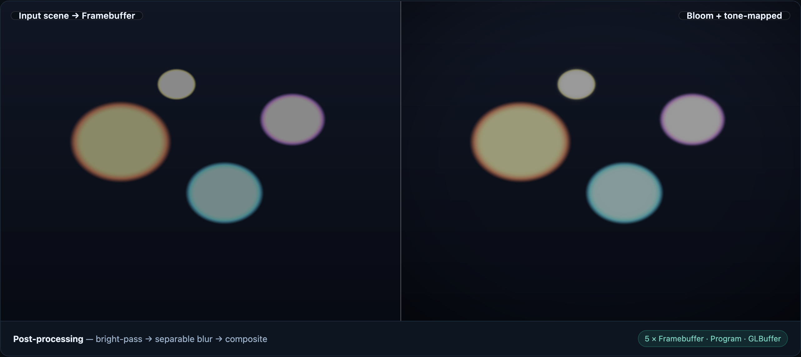
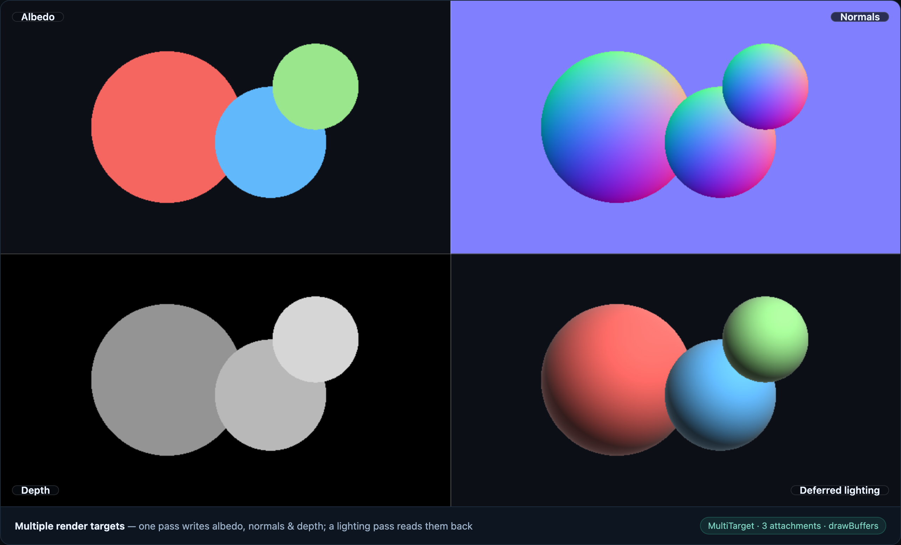
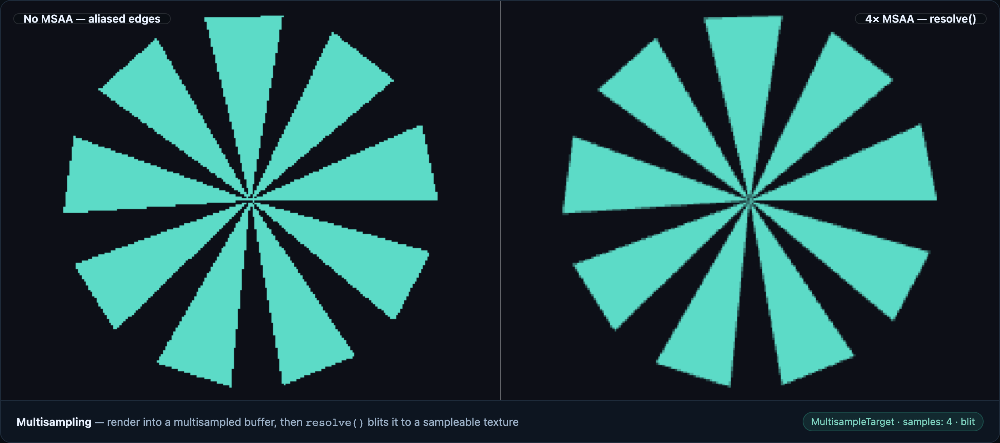
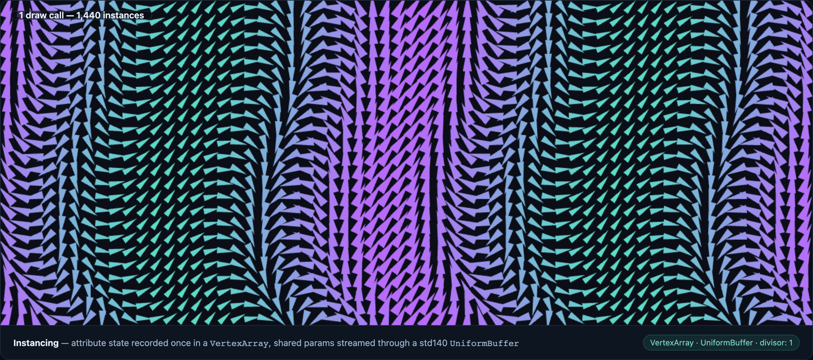
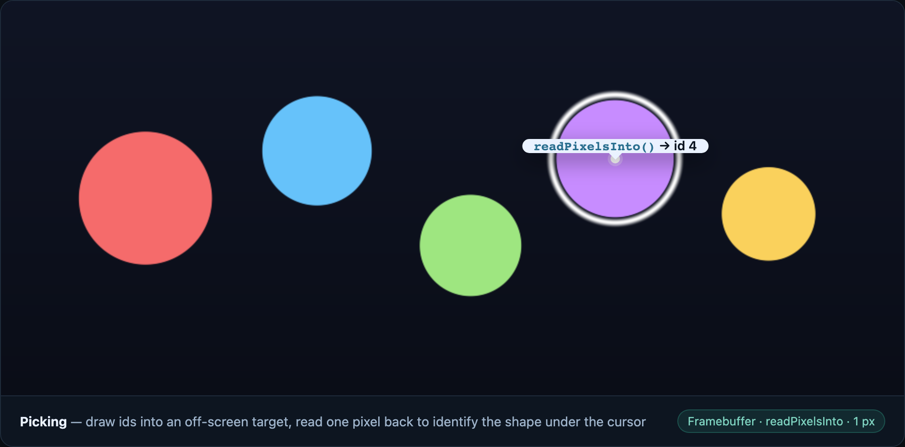

# Examples gallery

Each example is a self-contained HTML page that imports the built package from
`../../dist` — no bundler, no framework, just the library against a real WebGL
context. Every image below is genuine rendered output captured in a headless
browser.

## Run them locally

```bash
pnpm install
pnpm build
pnpm dlx serve   # from the repository root, then open /examples/<name>/
```

Any static server works; the pages only need `dist/` to exist.

## The gallery

### [postprocessing](./postprocessing) — multi-framebuffer bloom

Bright-pass → separable blur → composite, built from five `Framebuffer`s.



### [gbuffer](./gbuffer) — deferred shading with `MultiTarget` (WebGL2)

One geometry pass fills albedo, normal, and depth attachments; a lighting pass
reads all three back for deferred shading.



### [antialiasing](./antialiasing) — `MultisampleTarget` MSAA (WebGL2)

The same geometry rendered aliased and with 4× MSAA + `resolve()`, magnified
side by side.



### [instancing](./instancing) — `VertexArray` + `UniformBuffer` (WebGL2)

1,440 instances in a single draw call: the attribute layout (with per-instance
`divisor` attributes) is recorded once in a `VertexArray`, and shared
parameters stream through a `std140` `UniformBuffer`.



### [picking](./picking) — color-id picking with `readPixelsInto`

Object ids rendered into an off-screen target; one-pixel readback identifies
the shape under the cursor with zero per-frame allocation.



### [minimal-triangle](./minimal-triangle) — smallest end-to-end render

`Shader` + `Program` + `GLBuffer`, nothing else.


## Without screenshots

| Example                              | Shows                                            |
| ------------------------------------ | ------------------------------------------------ |
| [pipeline](./pipeline)               | Texture2D → Framebuffer → screen pass            |
| [fbo-postprocess](./fbo-postprocess) | Framebuffer off-screen post-processing           |
| [self-test](./self-test)             | Real-WebGL assertion harness for `check:browser` |

## How these stay honest

`pnpm check:browser` loads the self-test harness against a real WebGL context
(pixel readback, texture uploads, error paths, VAO/UBO draws) and smoke-tests
every example for load errors — it runs in CI on every push. `pnpm screenshots`
regenerates the images above from the live pages via
`scripts/capture-showcase.mjs`, so a screenshot can never drift from what the
code actually renders.
