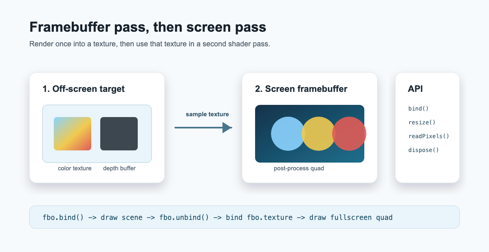

# FBO post-process workflow

This is the first visual acceptance target for WebGraphicLibrary v2.

The intended workflow is:

1. Create a `Framebuffer` with a color texture and optional depth storage.
2. Render a scene while the framebuffer is bound.
3. Unbind the framebuffer.
4. Sample `framebuffer.texture` in a screen-space pass.
5. Resize and dispose the framebuffer with the rest of the render lifecycle.

This example starts as a documented workflow target. The next package slice will add the shader, program, buffer, and texture helpers needed for a complete browser demo without raw WebGL setup code in the example.
